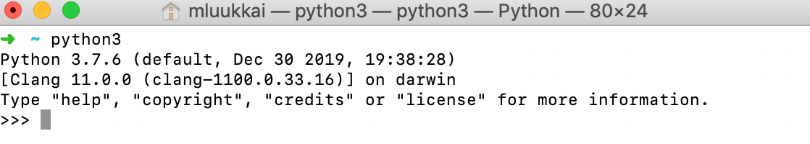
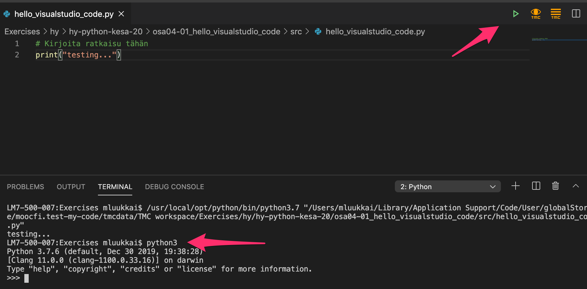
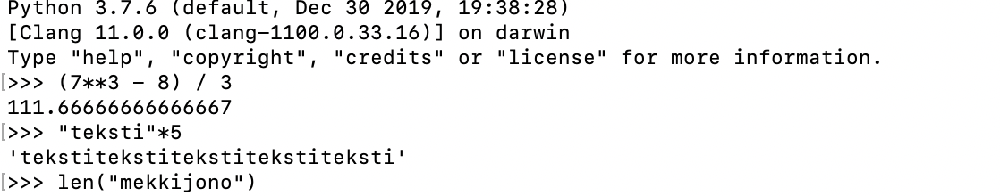

<text-box variant='learningObjectives' name="Leerdoelen">

Na deze sectie:

- Heb je Visual Studio Code geïnstalleerd en weet je hoe je code ermee kunt uitvoeren.

</text-box>

Tot nu toe zijn alle oefeningen op deze cursus direct op de cursuspagina's voltooid in ingesloten editorvensters. Programmeren in de browser is zeer geschikt voor de allereerste stappen in programmeren, maar nu is het tijd om een aparte editor te gaan gebruiken die speciaal is gemaakt voor programmeren.

Er zijn tientallen verschillende editors die geschikt zijn voor programmeren. Op deze cursus zullen we de [Visual Studio Code](https://code.visualstudio.com/) editor gebruiken, die de afgelopen jaren aan populariteit heeft gewonnen.

Installeer nu de Visual Studio Code-editor op je eigen computer. Mogelijk moet je ook Python en de Visual Studio Code-plug-in voor Python installeren.

## Code uitvoeren

In Visual Studio Code is de eenvoudigste manier om je code uit te voeren door op de driehoek in de rechterbovenhoek te klikken. Het kan soms gebeuren dat er een programma op de achtergrond blijft draaien, bijvoorbeeld omdat het wacht op invoer van de gebruiker of vastzit in een oneindige lus, zonder dat je het merkt. Je merkt dit pas op wanneer je probeert het volgende programma uit te voeren, dat simpelweg niet wordt uitgevoerd omdat de vorige uitvoering nog steeds resources in beslag neemt. Een snelle oplossing is om tegelijkertijd op de toetsen _Control_+_C_ te drukken, waarmee de uitvoering van elk lopend proces wordt gestopt. Het volgende programma zou nu zonder problemen moeten worden uitgevoerd.

## De interactieve Python-interpreter

Een van de belangrijkste tools voor elke Python-programmeur is de interactieve Python-interpreter.

Het starten van de interpreter kan afhangen van je platform. Op een Linux- of Mac-systeem kun je `python3` typen in de terminal. Op Windows kan het commando op de opdrachtregel `python` zijn. Het starten van de interpreter op een Mac ziet er als volgt uit:

Het is ook mogelijk om de interpreter binnen Visual Studio Code te starten. Voer eerst een programma uit door op de driehoek te klikken. Dit opent een _Terminal_-sectie op je scherm, waar je nu `python3` (of `python`) kunt typen:

Je kunt ook een browsergebaseerde Python-interpreter proberen, zoals <https://www.python.org/shell/>.

De interpreter is een manier om Python-code regel voor regel uit te voeren zodra je het schrijft. Wanneer je een regel code schrijft en op _Enter_ drukt, voert de interpreter de code onmiddellijk uit en laat de resultaten zien:

