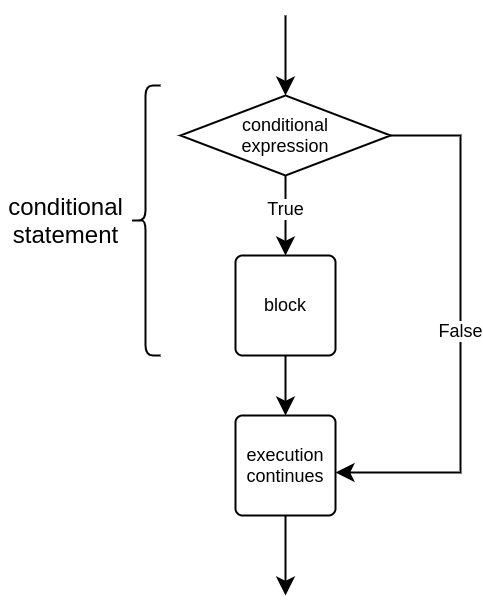
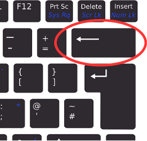

<text-box variant='learningObjectives' name="Leerdoelen">

Na deze sectie:

- Kun je een eenvoudige voorwaardelijke instructie gebruiken in programmeren.
- Weet je wat een Booleaanse waarde is.
- Kun je voorwaardelijke instructies uitdrukken met vergelijkingsoperatoren.

</text-box>

Tot nu toe hebben we programma's geschreven die regel voor regel worden uitgevoerd. In plaats van elke regel code telkens uit te voeren wanneer een programma wordt gestart, is het vaak nuttig om secties van het programma te maken die alleen in bepaalde situaties worden uitgevoerd.

Bijvoorbeeld, de volgende code controleert of de gebruiker meerderjarig is:

```python
age = int(input("Hoe oud ben je? "))

if age > 17:
    print("Je bent meerderjarig!")
    print("Hier is een kopie van GTA6 voor jou.")

print("Volgende klant, alsjeblieft!")
```

Wanneer de gebruiker ouder is dan 17, zou de uitvoering van het programma er als volgt uitzien:

<sample-output>

Hoe oud ben je? **18**
Je bent meerderjarig!
Hier is een kopie van GTA6 voor jou.
Volgende klant, alsjeblieft!

</sample-output>

Als de gebruiker 17 jaar of jonger is, wordt alleen dit afgedrukt:

<sample-output>

Hoe oud ben je? **16**
Volgende klant, alsjeblieft!

</sample-output>

Deze voorbeelden laten ons zien dat de waarde die als invoer wordt gegeven van invloed is op welke delen van het programma worden uitgevoerd. Het programma bevat een _voorwaardelijke instructie_ met een codeblok dat alleen wordt uitgevoerd als de voorwaarde in de instructie waar is.



In een voorwaardelijke instructie wordt het trefwoord `if` gevolgd door een _voorwaarde_, zoals een vergelijking van twee waarden. Het codeblok dat volgt op deze kopregel wordt alleen uitgevoerd als de voorwaarde waar is.

Let op het dubbele punt-teken na de `if`-kopregel. In de volgende code is er geen dubbele punt:

```python
age = 10

# geen dubbele punt aan het einde van de volgende regel
if age > 17
    print("Je bent meerderjarig.")
```

Bij het uitvoeren veroorzaakt dit een foutmelding:

<sample-output>
<pre>
Bestand "programma.py", regel 3
  if age > 17
            ^
SyntaxError: expected ':'
</pre>
</sample-output>

## Vergelijkingsoperatoren

In de meeste gevallen bestaan voorwaarden uit het vergelijken van twee waarden. Hier is een tabel met de meest gebruikte vergelijkingsoperatoren in Python:

| Operator | Betekenis      | Voorbeeld |
|:--------:|----------------|-----------|
| `==`     | Gelijk aan     | `a == b`  |
| `!=`     | Niet gelijk aan | `a != b` |
| `>`      | Groter dan     | `a > b`   |
| `>=`     | Groter dan of gelijk aan | `a >= b` |
| `<`      | Kleiner dan    | `a < b`   |
| `<=`     | Kleiner dan of gelijk aan | `a <= b` |

Laten we eens kijken naar een programma dat verschillende dingen afdrukt op basis van of het getal dat de gebruiker invoert negatief, positief of gelijk aan nul is:

```python
number = int(input("Typ een getal in: "))

if number < 0:
    print("Het getal is negatief.")

if number > 0:
    print("Het getal is positief.")

if number == 0:
    print("Het getal is nul.")
```

Voorbeelden van hoe het programma werkt met drie verschillende invoeren:

<sample-output>

Typ een getal in: **15**
Het getal is positief.

</sample-output>

<sample-output>

Typ een getal in: **-18**
Het getal is negatief.

</sample-output>

<sample-output>

Typ een getal in: **0**
Het getal is nul.

</sample-output>

## Inspringen

Python herkent dat een codeblok onderdeel is van een voorwaardelijke instructie als elke regel code in het blok op dezelfde manier is _ingesprongen_. Er moet een beetje witruimte aan het begin van elke regel code binnen het codeblok zijn. Elke regel moet dezelfde hoeveelheid witruimte hebben.

Bijvoorbeeld:

````python
password = input("Typ een wachtwoord in: ")

if password == "cat":
    print("Je kende het wachtwoord!")
    print("Je moet ofwel de beoogde gebruiker zijn...")
    print("...of een zeer bekwame hacker.")

print("Het programma is klaar met zijn uitvoering. Bedankt en tot ziens!")
````

Je kunt de Tab-toets, afgekort als _tabulator_-toets, gebruiken om een ​​bepaalde hoeveelheid witruimte in te voegen.


Veel teksteditors zullen automatisch de volgende regel inspringen wanneer de Enter-toets wordt ingedrukt na een dubbele punt. Wanneer je een ingesprongen codeblok wilt beëindigen, kun je de `Backspace`-toets gebruiken om terug te keren naar het begin van de regel.




<in-browser-programming-exercise name="Orwell" tmcname="part01-21_orwell">

Please write a program which asks the user for an integer number. The program should print out "Orwell" if the number is exactly 1984, and otherwise do nothing.

<sample-output>

Please type in a number: **2020**

</sample-output>

<sample-output>

Please type in a number: **1984**
Orwell

</sample-output>

</in-browser-programming-exercise>
<in-browser-programming-exercise name="Absolute value" tmcname="part01-22_absolute_value">

Please write a program which asks the user for an integer number. If the number is less than zero, the program should print out the number multiplied by -1. Otherwise the program prints out the the number as is. Please have a look at the examples of expected behaviour below.

<sample-output>

Please type in a number: **-7**
The absolute value of this number is 7

</sample-output>

<sample-output>

Please type in a number: **1**
The absolute value of this number is 1

</sample-output>

<sample-output>

Please type in a number: **-99**
The absolute value of this number is 99

</sample-output>

</in-browser-programming-exercise>


<in-browser-programming-exercise name="Soup or no soup" tmcname="part01-23_soup_or_no_soup">

Please write a program which asks for the user's name. If the name is anything but "Jerry", the program then asks for the number of portions and prints out the total cost. The price of a single portion is 5.90.

Two examples of the program's execution:

<sample-output>

Please tell me your name: **Kramer**
How many portions of soup? **2**
The total cost is 11.8
Next please!

</sample-output>

<sample-output>

Please tell me your name: **Jerry**
Next please!

</sample-output>

</in-browser-programming-exercise>


<in-browser-programming-exercise name="Order of magnitude" tmcname="part01-24_order_of_magnitude">

Please write a program which asks the user for an integer number. The program should then print out the magnitude of the number according to the following examples.

<sample-output>

Please type in a number: **950**
This number is smaller than 1000
Thank you!

</sample-output>

<sample-output>

Please type in a number: **59**
This number is smaller than 1000
This number is smaller than 100
Thank you!

</sample-output>

<sample-output>

Please type in a number: **2**
This number is smaller than 1000
This number is smaller than 100
This number is smaller than 10
Thank you!

</sample-output>

<sample-output>

Please type in a number: **1123**
Thank you!

</sample-output>


</in-browser-programming-exercise>

## Booleaanse waarden en Booleaanse expressies

Elke voorwaarde die in een voorwaardelijke instructie wordt gebruikt, resulteert in een waarheidswaarde, dat wil zeggen `True` (waar) of `False` (onwaar). Bijvoorbeeld, de voorwaarde `a < 5` is waar als `a` kleiner is dan 5, en onwaar als `a` gelijk is aan of groter is dan 5.

Deze waarden worden vaak _Booleaanse_ waarden genoemd, genoemd naar de Engelse wiskundige George Boole. In Python worden ze behandeld door het gegevenstype `bool`. Variabelen van het type `bool` kunnen alleen de waarden `True` of `False` hebben.

Elk stuk code dat resulteert in een Booleaanse waarde wordt een _Booleaanse expressie_ genoemd. Bijvoorbeeld, de voorwaarde in een voorwaardelijke instructie is altijd een Booleaanse expressie, en de woorden _voorwaarde_ en _Booleaanse expressie_ kunnen vaak door elkaar worden gebruikt.

Het resultaat van een Booleaanse expressie kan worden opgeslagen in een variabele, net als het resultaat van een numerieke berekening:

```python
a = 3
voorwaarde = a < 5
print(voorwaarde)
if voorwaarde:
    print("a is kleiner dan 5")
```

<sample-output>

True
a is kleiner dan 5

</sample-output>

De trefwoorden `True` en `False` van Python kunnen ook direct worden gebruikt. In het volgende voorbeeld wordt het `print`-commando elke keer uitgevoerd, omdat de waarde van de voorwaarde `True` is:

```python
voorwaarde = True
if voorwaarde:
    print("Dit wordt elke keer afgedrukt.")
```

<sample-output>

Dit wordt elke keer afgedrukt.

</sample-output>

Een programma als dit is niet erg nuttig, maar later in de cursus zul je voorbeelden zien waarin Booleaanse variabelen erg handig zijn.

<in-browser-programming-exercise name="Calculator" tmcname="part01-25_calculator">

Please write a program which asks the user for two numbers and an operation. If the operation is _add_, _multiply_ or _subtract_, the program should calculate and print out the result of the operation with the given numbers. If the user types in anything else, the program should print out nothing.

Some examples of expected behaviour:

<sample-output>

Number 1: **10**
Number 2: **17**
Operation: **add**

10 + 17 = 27

</sample-output>

<sample-output>

Number 1: **4**
Number 2: **6**
Operation: **multiply**

4 * 6 = 24

</sample-output>

<sample-output>

Number 1: **4**
Number 2: **6**
Operation: **subtract**

4 - 6 = -2

</sample-output>

</in-browser-programming-exercise>

<in-browser-programming-exercise name="Temperatures" tmcname="part01-26_temperatures">

Please write a program which asks the user for a temperature in degrees Fahrenheit, and then prints out the same in degrees Celsius. If the converted temperature falls below zero degrees Celsius, the program should also print out "Brr! It's cold in here!".

The formula for converting degrees Fahrenheit to degrees Celsius can be found easily by any search engine of your choice.

Two examples of expected behaviour:

<sample-output>

Please type in a temperature (F): **101**
101 degrees Fahrenheit equals 38.333333333333336 degrees Celsius

Please type in a temperature (F): **21**
21 degrees Fahrenheit equals -6.111111111111111 degrees Celsius
Brr! It's cold in here!

</sample-output>

</in-browser-programming-exercise>

<in-browser-programming-exercise name="Daily wages" tmcname="part01-27_daily_wages">

Please write a program which asks for the hourly wage, hours worked, and the day of the week. The program should then print out the daily wages, which equal hourly wage multiplied by hours worked, except on Sundays when the hourly wage is doubled.

<sample-output>

Hourly wage: **8.5**
Hours worked: **3**
Day of the week: **Monday**
Daily wages: 25.5 euros

</sample-output>

<sample-output>

Hourly wage: **12.5**
Hours worked: **10**
Day of the week: **Sunday**
Daily wages: 250.0 euros

</sample-output>

</in-browser-programming-exercise>

<in-browser-programming-exercise name="Loyalty bonus" tmcname="part01-28_loyalty_bonus">

This program calculates the end of year bonus a customer receives on their loyalty card. The bonus is calculated with the following formula:

* If there are less than a hundred points on the card, the bonus is 10 %
* In any other case the bonus is 15 %

The program should work like this:

<sample-output>

How many points are on your card? **55**
Your bonus is 10 %
You now have 60.5 points

</sample-output>

But there is a problem with the program, so with some inputs it doesn't work quite right:

<sample-output>

How many points are on your card? **95**
Your bonus is 10 %
Your bonus is 15 %
You now have 120.175 points

</sample-output>

Please fix the program so that there is always either a 10 % or a 15 % bonus, but never both.

</in-browser-programming-exercise>

<in-browser-programming-exercise name="What to wear tomorrow" tmcname="part01-29_what_to_wear_tomorrow">

Please write a program which asks for tomorrow's weather forecast and then suggests weather-appropriate clothing.

The suggestion should change if the temperature (measured in degrees Celsius) is over 20, 10 or 5 degrees, and also if there is rain on the radar.

Some examples of expected behaviour:

<sample-output>

What is the weather forecast for tomorrow?
Temperature: **21**
Will it rain (yes/no): **no**
Wear jeans and a T-shirt

</sample-output>

<sample-output>

What is the weather forecast for tomorrow?
Temperature: **11**
Will it rain (yes/no): **no**
Wear jeans and a T-shirt
I recommend a jumper as well

</sample-output>

<sample-output>

What is the weather forecast for tomorrow?
Temperature: **7**
Will it rain (yes/no): **no**
Wear jeans and a T-shirt
I recommend a jumper as well
Take a jacket with you

</sample-output>

<sample-output>

What is the weather forecast for tomorrow?
Temperature: **3**
Will it rain (yes/no): **yes**
Wear jeans and a T-shirt
I recommend a jumper as well
Take a jacket with you
Make it a warm coat, actually
I think gloves are in order
Don't forget your umbrella!

</sample-output>

</in-browser-programming-exercise>

<in-browser-programming-exercise name="Solving a quadratic equation" tmcname="part01-30_quadratic_formula">

In the Python `math` module there is the function `sqrt`, which calculates the square root of a number. You can use it like so:

```python
from math import sqrt

print(sqrt(9))
```

This should print out

<sample-output>

3.0

</sample-output>

We will return to the concept of a _module_ and the `import` statement later. For now, it is sufficient to understand that the line `from math import sqrt` allows us to use the `sqrt` function in our program.

Please write a program for solving a quadratic equation of the form ax²+bx+c. The program asks for values a, b and c. It should then use the quadratic formula to solve the equation. The quadratic formula expressed with the Python `sqrt` function is as follows:

x = (-b ± sqrt(b²-4ac))/(2a).

You can assume the equation will always have two real roots, so the above formula will always work.

An example of expected behaviour:

<sample-output>

Value of a: **1**
Value of b: **2**
Value of c: **-8**

The roots are 2.0 and -4.0

</sample-output>

</in-browser-programming-exercise>
