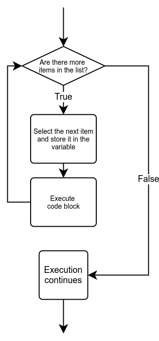

<text-box variant='learningObjectives' name="Leerdoelen">

Na deze sectie:

- Weet je hoe een Python `for`-lus werkt.
- Kun je een `for`-lus gebruiken om door lijsten en strings te itereren.

</text-box>

Je kunt een lijstindex gebruiken om elk element in een lijst te benaderen.

```python
my_list = [3, 2, 4, 5, 2]

print(my_list[0])
print(my_list[1])
print(my_list[2])
```

<sample-output>

3
2
4
5
2

</sample-output>

Dit werkt uiteraard, maar het werkt niet als we de lengte van de lijst niet weten en het ziet er niet erg mooi uit. Gelukkig biedt Python een intuïtievere manier om door lijsten, strings en andere vergelijkbare structuren te gaan.

## De for-lus

Als je door een verzameling items wilt gaan, kan de Python `for`-lus dit voor je doen. Bijvoorbeeld, de lus kan alle items in een lijst van het eerste tot het laatste item doorlopen.

In een latere les zullen we een ander soort lus zien: de `while`-lus. Een `while`-lus is een meer algemene versie van de `for`-lus die we hier zullen zien. Een `for`-lus werkt alleen met lijstachtige gegevenstypen, zoals lijsten en strings. Een `while`-lus werkt ook met lijstachtige gegevenstypen, maar ook met veel meer.

Het idee is dat de `for`-lus de items in de verzameling één voor één neemt en dezelfde acties op elk item uitvoert. De programmeur hoeft zich geen zorgen te maken over welk item er wordt verwerkt. De syntaxis van de for-lus is als volgt:

```python
for <variabele> in <verzameling>:
    <blok>
```

De `for`-lus neemt een item uit de verzameling, kent het toe aan de variabele, voert het blok code uit en gaat verder met het volgende item. Wanneer alle items in de verzameling zijn verwerkt, gaat de uitvoering van het programma verder vanaf de regel na de lus.



Het volgende programma drukt alle items in een lijst af met behulp van een `for`-lus:

```python
my_list = [3, 2, 4, 5, 2]

for item in my_list:
    print(item)
```

<sample-output>

3
2
4
5
2

</sample-output>

In vergelijking met het voorbeeld aan het begin van deze sectie is de structuur veel gemakkelijker te begrijpen. Een `for`-lus maakt rechtlijnige doorloop van een verzameling items zeer eenvoudig.

Hetzelfde principe geldt voor karakters in een string:

```python
name = input("Typ alsjeblieft je naam: ")

for character in name:
    print(character)
```

<sample-output>

Typ alsjeblieft je naam: **Grace**
G
r
a
c
e

</sample-output>

<programming-exercise name='Sterrenregen' tmcname='part04-20_star_studded'>

Schrijf alsjeblieft een programma dat de gebruiker vraagt om een string in te typen. Het programma drukt vervolgens elk ingevoerd karakter op een aparte regel af. Na elk karakter moet er een ster (*) op een eigen regel worden afgedrukt.

Zo zou het moeten werken:

<sample-output>

Typ alsjeblieft een string: **Python**
P
*
y
*
t
*
h
*
o
*
n
*

</sample-output>

**NB:** In deze oefening wordt niet gevraagd om functies te schrijven, dus je moet __geen__ code binnen een `if __name__ == "__main__"`-blok plaatsen.

</programming-exercise>

## De functie `range`

Vaak weet je hoe vaak je een bepaald stuk code wilt herhalen. Bijvoorbeeld, je wilt mogelijk alle getallen tussen 1 en 100 doorlopen. De functie `range` in combinatie met een `for`-lus kan dit voor je doen.

Er zijn een paar verschillende manieren om de `range`-functie aan te roepen. De eenvoudigste manier is om de functie slechts één argument te geven, wat het eindpunt van het bereik aangeeft. Het eindpunt zelf is uitgesloten, net zoals bij string-slices. Met andere woorden, de functieaanroep `range(n)` geeft een lus met een bereik van 0 tot `n-1`:

```python
for i in range(5):
    print(i)
```

<sample-output>

0
1
2
3
4

</sample-output>

Met twee argumenten geeft de functie een bereik tussen de twee getallen. De functie `range(a, b)` geeft een bereik dat begint bij `a` en eindigt bij `b-1`:

```python
for i in range(3, 7):
    print(i)
```

<sample-output>

3
4
5
6

</sample-output>

Ten slotte kun je met een derde argument ook de grootte van de _stap_ specificeren die het bereik neemt bij elke waarde. De functieaanroep `range(a, b, c)` geeft een bereik dat begint bij `a`, eindigt bij `b-1` en bij elke stap met `c` verandert:

```python
for i in range(1, 9, 2):
    print(i)
```

<sample-output>

1
3
5
7

</sample-output>

Een stap kan ook negatief zijn. Dan zal het bereik in omgekeerde volgorde zijn. Let op dat hierbij de eerste twee argumenten ook worden omgedraaid:

```python
for i in range(6, 2, -1):
    print(i)
```

<sample-output>

6
5
4
3

</sample-output>

<programming-exercise name='Van negatief naar positief' tmcname='part04-21_negative_to_positive'>

Schrijf alsjeblieft een programma dat de gebruiker vraagt om een positief geheel getal N. Het programma drukt vervolgens alle getallen af tussen -N en N (inclusief), maar _laat het getal

0 buiten beschouwing_. Elk getal moet op een aparte regel worden afgedrukt.

Een voorbeeld van het verwachte gedrag:

<sample-output>

Typ alsjeblieft een positief geheel getal: **4**
-4
-3
-2
-1
1
2
3
4

</sample-output>

**NB:** In deze oefening wordt niet gevraagd om functies te schrijven, dus je moet __geen__ code binnen een `if __name__ == "__main__"`-blok plaatsen.

</programming-exercise>

## Van een bereik naar een lijst

De functie `range` retourneert een bereikobject dat zich op veel manieren gedraagt als een lijst, maar dat eigenlijk geen lijst is. Als je de waarde die de functie retourneert probeert af te drukken, zie je alleen een beschrijving van een bereikobject:

```python
numbers = range(2, 7)
print(numbers)
```

<sample-output>

range(2, 7)

</sample-output>

Met de functie `list` kun je een bereik omzetten in een lijst. De lijst bevat alle waarden die zich in het bereik bevinden. De cursus Gevorderd Programmeren, die volgt op deze cursus, zal meer inzicht geven in dit onderwerp.

```python
numbers = list(range(2, 7))
print(numbers)
```

<sample-output>

[2, 3, 4, 5, 6]

</sample-output>

## Herinnering aan de vereisten van de automatische tests

Tot nu toe, toen de oefeningen je vroegen om functies te schrijven, zagen de sjablonen er als volgt uit:

```python
# Schrijf hier je oplossing
# Je kunt je functie testen door deze te bellen binnen het volgende blok
if __name__ == "__main__":
    zin = "it was a dark and stormy python"
    print(first_word(zin))
    print(second_word(zin))
    print(last_word(zin))
```

Vanaf nu zullen er geen herinneringen meer zijn in de sjablonen om het `if __name__ == "__main__"`-blok te gebruiken. De automatische tests zullen nog steeds vereisen dat je dit gebruikt, dus je moet het blok zelf toevoegen wanneer je je functie test binnen de hoofdfunctie van je programma.

**NB:** Sommige oefeningen, zoals de oefening _Palindromes_ die hier in deze sectie volgt, verwachten ook dat je code schrijft die de door jou geschreven functie aanroept. Deze code mag _niet_ binnen een `if __name__ == "__main__"`-blok worden geplaatst. De automatische tests zullen geen enkele code in dat blok uitvoeren, dus je oplossing is niet volledig als je je functieaanroepen daar plaatst.

<programming-exercise name='Lijst van sterren' tmcname='part04-22_list_of_stars'>

Schrijf alsjeblieft een functie genaamd `lijst_van_sterren`, die een lijst van gehele getallen als argument neemt. De functie moet regels met sterretjes afdrukken. De getallen in de lijst geven aan hoeveel sterretjes elke regel moet bevatten.

Bijvoorbeeld, met de functieaanroep `lijst_van_sterren([3, 7, 1, 1, 2])` zou het volgende moeten worden afgedrukt:

<sample-output>

<pre>
***
*******
*
*
**
</pre>

</sample-output>

<!-- **NB:** Er zijn momenteel problemen met het uitvoeren van enkele van de testen in Windows. Als je de volgende foutmelding tegenkomt:


kun je de tests uitvoeren door ze naar de server te sturen door te kiezen voor de knop voor het uitvoeren van de tests in het TMC-menu dat wordt geopend door op het symbool rechts van de knop voor het uitvoeren van de tests te klikken en _Submit solutions_ te selecteren.

Het probleem kan worden opgelost door naar het installatiemenu van de extensie te gaan en de "TMC Data" te veranderen naar een andere locatie waarvan het pad naar de bestanden korter is, de knop _change path_ in de onderstaande afbeelding. Het kan even duren voordat de verplaatsing is voltooid, dus wacht tot de bewerking is voltooid.


Er wordt momenteel gewerkt aan een betere oplossing voor dit probleem. -->

</programming-exercise>

<programming-exercise name='Anagrammen' tmcname='part04-23_anagrams'>

Schrijf alsjeblieft een functie genaamd `anagrammen`, die twee strings als argumenten neemt. De functie retourneert `True` als de strings anagrammen van elkaar zijn. Twee woorden zijn anagrammen als ze precies dezelfde karakters bevatten.

Enkele voorbeelden van hoe de functie zou moeten werken:

```python
print(anagrammen("tame", "meta")) # True
print(anagrammen("tame", "mate")) # True
print(anagrammen("tame", "team")) # True
print(anagrammen("tabby", "batty")) # False
print(anagrammen("python", "java")) # False
```

Hint: de functie `sorted` kan ook worden gebruikt op strings.

</programming-exercise>

<programming-exercise name='Palindromen' tmcname='part04-24_palindromes'>

Schrijf alsjeblieft een functie genaamd `palindromen`, die een string als argument neemt en `True` retourneert als de string een palindroom is. Palindromen zijn woorden die precies hetzelfde worden gespeld als ze

 achterstevoren worden gelezen.

Schrijf ook een hoofdfunctie die de gebruiker vraagt om woorden in te typen totdat ze een palindroom typen:

<sample-output>

Typ alsjeblieft een palindroom: **python**
dat was geen palindroom
Typ alsjeblieft een palindroom: **java**
dat was geen palindroom
Typ alsjeblieft een palindroom: **oddoreven**
dat was geen palindroom
Typ alsjeblieft een palindroom: **neveroddoreven**
neveroddoreven is een palindroom!

</sample-output>

**NB:** De hoofdfunctie **mag niet** binnen een `if __name__ == "__main__":`-blok worden geplaatst.

</programming-exercise>

<programming-exercise name='De som van positieve getallen' tmcname='part04-25_sum_of_positives'>

Schrijf alsjeblieft een functie genaamd `som_van_positieven`, die een lijst van gehele getallen als argument neemt. De functie retourneert de som van de positieve waarden in de lijst.

```python
mijn_lijst = [1, -2, 3, -4, 5]
resultaat = som_van_positieven(mijn_lijst)
print("Het resultaat is", resultaat)
```

<sample-output>

Het resultaat is 9

</sample-output>

</programming-exercise>

In deze oefeningen zullen we lijsten gebruiken als argumenten en retourwaarden. Dit is behandeld in de [vorige sectie](/part-4/3-lists#a-list-as-an-argument-or-a-return-value), als je een opfriscursus nodig hebt.

<programming-exercise name='Even getallen' tmcname='part04-26_even_numbers'>

Schrijf alsjeblieft een functie genaamd `even_getallen`, die een lijst van gehele getallen als argument neemt. De functie retourneert een nieuwe lijst met daarin alleen de even getallen uit de oorspronkelijke lijst.

```python
mijn_lijst = [1, 2, 3, 4, 5]
nieuwe_lijst = even_getallen(mijn_lijst)
print("origineel", mijn_lijst)
print("nieuw", nieuwe_lijst)
```

<sample-output>

origineel [1, 2, 3, 4, 5]
nieuw [2, 4]

</sample-output>

</programming-exercise>

<programming-exercise name='De som van lijsten' tmcname='part04-27_sum_of_lists'>

Schrijf alsjeblieft een functie genaamd `lijst_som`, die twee lijsten van gehele getallen als argumenten neemt. De functie retourneert een nieuwe lijst met daarin de sommen van de items op elke index in de twee oorspronkelijke lijsten. Je mag ervan uitgaan dat beide lijsten evenveel items bevatten.

Een voorbeeld van de werking van de functie:

```python
a = [1, 2, 3]
b = [7, 8, 9]
print(lijst_som(a, b)) # [8, 10, 12]
```

</programming-exercise>

<programming-exercise name='Unieke getallen' tmcname='part04-28_distinct_numbers'>

Schrijf alsjeblieft een functie genaamd `unieke_getallen`, die een lijst van gehele getallen als argument neemt. De functie retourneert een nieuwe lijst met daarin de getallen uit de oorspronkelijke lijst op volgorde van grootte, en zodanig dat elk uniek getal slechts één keer voorkomt.

```python
mijn_lijst = [3, 2, 2, 1, 3, 3, 1]
print(unieke_getallen(mijn_lijst)) # [1, 2, 3]
```

</programming-exercise>

## Het beste of het slechtste item in een lijst vinden

Een zeer veelvoorkomende programmeertaak is het vinden van het beste of slechtste item in een lijst, volgens bepaalde criteria. Een eenvoudige oplossing is het gebruik van een hulpvariabele om te "onthouden" welk van de tot nu toe verwerkte items het meest geschikt was. Deze tijdelijke beste keuze wordt vervolgens vergeleken met elk item op zijn beurt, en aan het einde van de iteratie bevat de variabele het beste van de groep.

Een ruwe schets die nog niet helemaal compileert:

```python
beste = initiële_waarde # De initiële waarde hangt af van de situatie
for item in mijn_lijst:
    als item beter is dan beste:
        beste = item

# We hebben nu de beste gevonden!
```

De details van de uiteindelijke programmacode hangen af van het type items in de lijst, en ook van de criteria voor het kiezen van het beste (of slechtste) item. Soms heb je meer dan één hulpvariabele nodig.

Laten we dit methode een beetje oefenen.

<programming-exercise name='De lengte van het langste in de lijst' tmcname='part04-29_length_of_longest'>

Schrijf alsjeblieft een functie genaamd `lengte_van_langste`, die een lijst van strings als argument neemt. De functie retourneert de lengte van de langste string.

```python
mijn_lijst = ["eerste", "tweede", "vierde", "elfde"]

resultaat = lengte_van_langste(mijn_lijst)
print(resultaat)
```

```python
mijn_lijst = ["adele", "mark", "dorothy", "tim", "hedy", "richard"]

resultaat = lengte_van_lang

ste(mijn_lijst)
print(resultaat)
```

</programming-exercise>

<programming-exercise name='Het grootste in de lijst' tmcname='part04-30_max_of_a_list'>

Schrijf alsjeblieft een functie genaamd `grootste_in_lijst`, die een lijst van gehele getallen als argument neemt. De functie retourneert het grootste getal in de lijst.

```python
mijn_lijst = [3, 2, 7, 1, 2, 6, 8, 3, 1, 5]
resultaat = grootste_in_lijst(mijn_lijst)
print(resultaat)
```

```python
mijn_lijst = [1, 2, 3, 4, 5]
resultaat = grootste_in_lijst(mijn_lijst)
print(resultaat)
```

</programming-exercise>

<programming-exercise name='Het kleinste in de lijst' tmcname='part04-31_min_of_a_list'>

Schrijf alsjeblieft een functie genaamd `kleinste_in_lijst`, die een lijst van gehele getallen als argument neemt. De functie retourneert het kleinste getal in de lijst.

```python
mijn_lijst = [3, 2, 7, 1, 2, 6, 8, 3, 1, 5]
resultaat = kleinste_in_lijst(mijn_lijst)
print(resultaat)
```

```python
mijn_lijst = [1, 2, 3, 4, 5]
resultaat = kleinste_in_lijst(mijn_lijst)
print(resultaat)
```

</programming-exercise>

## Samenvatting

Je hebt nu geleerd hoe je door een lijst kunt itereren met behulp van een `for`-lus. Je kunt de elementen van de lijst benaderen door een lijstindex te gebruiken of direct door de elementen zelf te noemen. De `range`-functie kan worden gebruikt om herhaalde lussen te maken.

Daarnaast heb je geleerd hoe je het beste of slechtste item in een lijst kunt vinden, evenals het berekenen van de som van de getallen in een lijst.

In de volgende sectie zullen we het hebben over het aanroepen van functies, zodat je code kunt schrijven die hergebruik van code bevordert.
