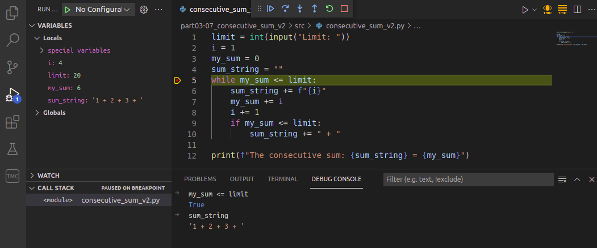

## The built-in debugger

We have already spent a fair amount of time and effort on developing debugging skills, mainly through print statement debugging. The Visual Studio Code editor has another tool at your disposal: a built-in _visual debugger_.

To start debugging, first you have to define a _breakpoint_ in your code. A breakpoint is a point in your program where the debugger halts execution. You can set a breakpoint by clicking on the left edge of any line in your program.

The following example is a slightly faulty attempt at solving the exercise _The sum of consecutive numbers_ in the [previous part](/part-3/1-loops-with-conditions). There is a breakpoint on line 5:

After the breakpoint has been set, choose _Start debugging_ from the _Run_ menu. This opens a list of options, where you should select _Python File_:

This starts the debugger, which executes your code as usual until the execution reaches a breakpoint and halts. If your code asks for input, remember to type that in in the terminal:

On the left there is now the _Variables_ view, which contains the current values of all variables active in the code. You can proceed with the execution line by line by clicking on the down arrow, which is labelled _Step into_.

In the image below the loop in the code has already been repeated a few times:

The debugger has a _Debug console_ tab, which lets you evaluate expressions with the current values stored in the variables. For example, you can check the value of the Boolean expression in the condition of the loop:

You can include several breakpoints in your program code. When execution has halted, you can start it again by clicking on the blue triangle. Execution proceeds until it reaches the next breakpoint.

The built-in visual debugger is a good alternative to debugging print statements. It is up to you which you choose to employ more in the future. Each programmer has their own preferences, but it's always a good idea to try different options before settling on any single solution.
